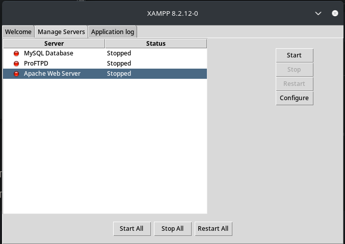

<h1 style="color:orange" >XAMPP Doc</h1>

## Runnning XAMPP for PHP-MySQL server

:::details About XAmpp

### What is XAMPP?

XAMPP stands for Cross-Platform (X), Apache (A), MariaDB (M), PHP (P) and Perl (P). 

It is a simple and lightweight solution that allows you to create a local web server for testing and deployment purposes. It is open-source and free to use.

:::

## Running XAMPP : 

Opening the XAMPP control panel, we can start the Apache server and MySQL server.

To open Control Panel, run the following command:

```bash
sudo /opt/lampp/manager-linux-x64.run
```



The hosted website on xampp is from a designated htdocs folder.

This folder is initially at `/opt/lampp/htdocs` but can be changed to any other folder.

:::details Starting/ Stopping XAMPP Server

To start the XAMPP server, run the following command:

```bash
sudo /opt/lampp/lampp start
```

To stop the XAMPP server, run the following command:

```bash
sudo /opt/lampp/lampp stop
```

To restart the XAMPP server, run the following command:

```bash
sudo /opt/lampp/lampp restart
```

Sometimes we get the error `XAMPP: Another web server daemon is already running.`

To fix this, run the following command:

```bash
sudo systemctl stop apache2
```

View current status of the XAMPP server using :

```bash

sudo /opt/lampp/lampp status

```

:::

:::details Changing the htdocs folder

To change the htdocs folder, follow these steps:

1. Open the `httpd.conf` file located at `/opt/lampp/etc/httpd.conf`.

```bash
sudo nano /opt/lampp/etc/httpd.conf
```

2. Find the line `DocumentRoot "/opt/lampp/htdocs"` and change it to the desired folder.

```bash 

DocumentRoot "/home/vktori/htdocs_custom"

```

3. Save the file and restart the Apache server.

```bash
sudo /opt/lampp/lampp restart
```

:::

::: details Adding SQL database to XAMPP

### To add a database to XAMPP, follow these steps:

1. Open the XAMPP control panel and start the MySQL server.
2. Open the phpMyAdmin tool : [http://localhost/phpmyadmin/](http://localhost/phpmyadmin/)
(If it doesnt say 404 Not found, you're in the right place)

3. Create a new database by clicking on the New button on the left sidebar.
4. Import the SQL file by clicking on the Import tab and selecting the file. OR use the blank database to create tables.
5. Done!

