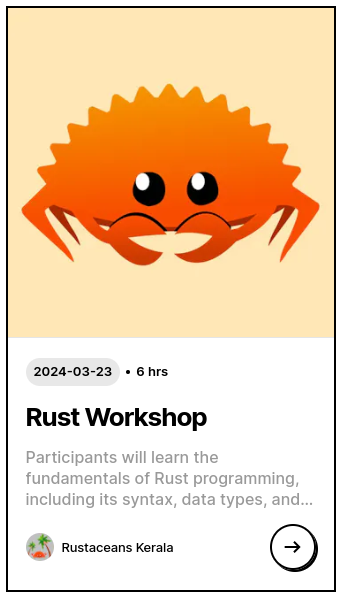

## How a React Component Changed The Course My Life

> Yes, you read that right. A React component changed the course of my life.

In the January of 2024, I was a sophomore at the college. I was a part of the college's tech club [FOSSCell NITC](https://www.fosscell.org/) and we were working on preparations for [FOSSMeet'24](https://www.fossmeet.net/).

The seniors were developing it and i compelled one of them to add me in the group as well. A meeting was held on January 13th at 10AM, and everyone was assigned few components each. I was assigned the task of developing a simple card component that would display the event details. The catch was the stack they were using. They were using Next.js and Tailwind and I had never worked with it before. 

The senior incahrge was my role model and I wanted to impress him. I had to learn Next.js and Tailwind somehow and develop the component. And I decided to learn it OVERNIGHT. I started learning Next.js and Tailwind at 8PM and by 9AM, I had developed the component. I was so proud of myself.
