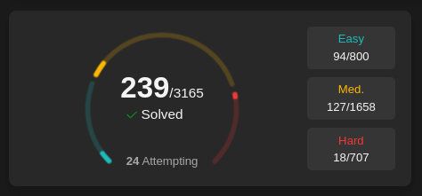
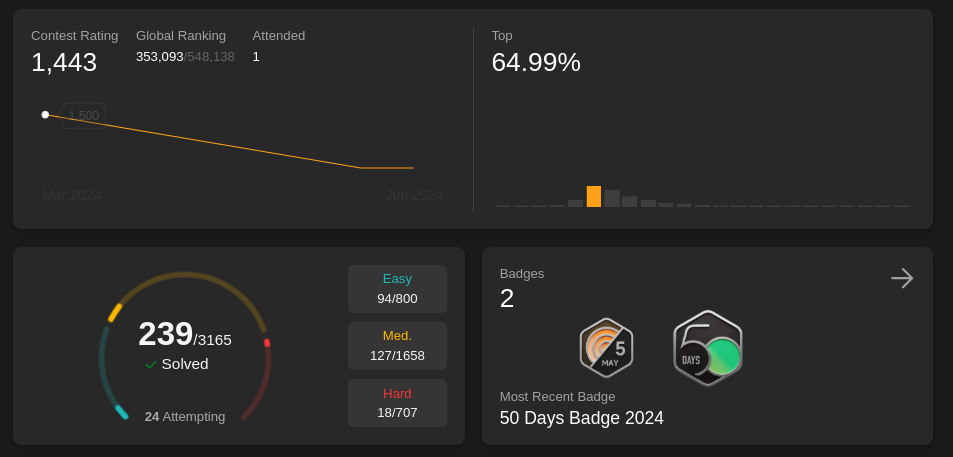
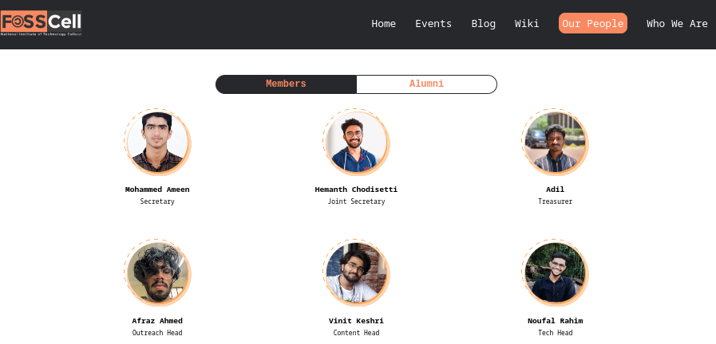
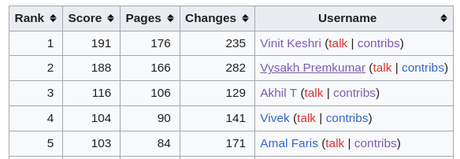
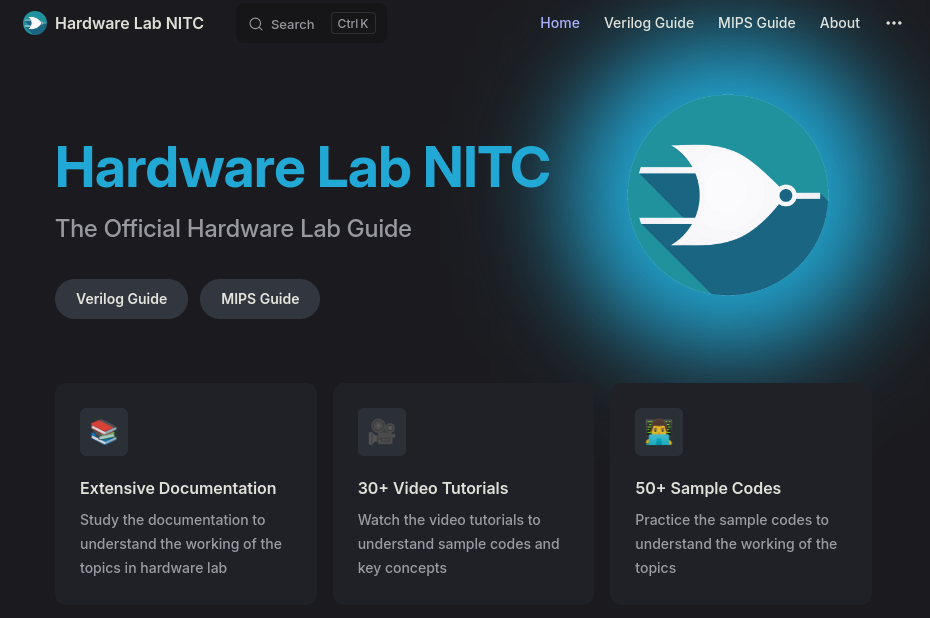
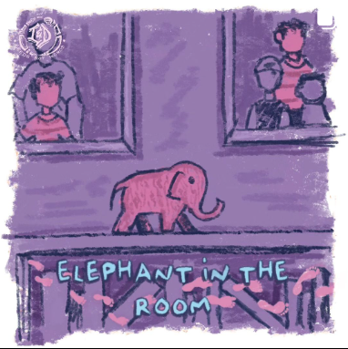

# Personal Audit

**`May 5th, 2024` to `June 15th, 2024`**

## 1. Journal details

:::details Recorded days:
1. May 16
1. May 17
1. May 20
1. May 21
1. May 22
1. May 24
1. May 25
1. May 28
1. May 29
1. May 31
1. June 1
1. June 2
1. June 3
1. June 4
1. June 6
1. June 7
1. June 8

:::

17  in total

:::details Leetcode/CF records: 

1. 2hrs : May 16
2. 2hrs : May 17
3. 3.5hrs : May 20
4. 3.5hrs : May 21
5. 2hrs : May 24
6. 4hrs : May 25
7. 2hrs : May 31
8. 2hrs : June 3
9. 2.5hrs : June 8

:::

:::danger Recorded Leetcode hours
Total: ``23.5hrs`` in 17 days(say recorded)

Average per recorded day: 1.38 Hrs
:::

## 2. Leetcode Problems details

:::details `8th May` Profile :

:::

:::details `16th June` Profile :

:::

### Leetcode Problems Solved

:::info 

<h3 style="color:aqua;">Easy</h3>  
<h4> 64 -> 94 = 30</h4>

<h3 style="color:darkorange;">Medium</h3> 
<h4> 52 -> 127 = 75</h4>

<h3 style="color:red;">Hard</h3>
<h4> 4 -> 18 = 14</h4>

---

Total : 119 Problems in 40 days

Average : `2.975` = 3  problems per day 

:::

## 3. Club/Organizational Activities

:::details FOSS Cell
1. Opened PR for Website update

2. Wrote for Wiki

3. Attended Meeting

4. Edited FOSSMeet'24 report (Yet to be finished)

:::

:::details HW Lab

1. Attended Meeting
2. Published updated 

3. Helped maintain the github organization
4. Helped in making FSM question

:::

:::details LnD

1. Wrote and published an Article on Men's Mental Health

[Link](https://www.instagram.com/p/C7rai1IiVI4/?utm_source=ig_web_button_share_sheet&igsh=MzRlODBiNWFlZA%3D%3D)

:::

:::details GDSC

1. Built react component for the website(in progress)

:::

## 4. Personal Projects

1. Tinkered with Recharts and built some charts
2. Used shadcn components and built sortable table component
3. Built a simple blog using vitepress and deployed it on Github pages
4. Deployed TaylorWho on Github pages

## 5. Achievements

1. Solved 119 Leetcode problems in 40 days
2. Got appointed as the FOSS Cell Content Head
3. 